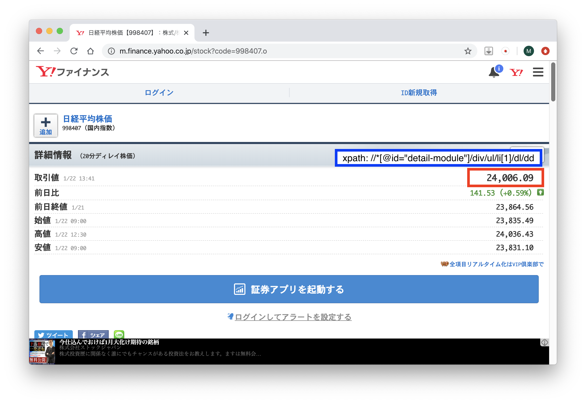
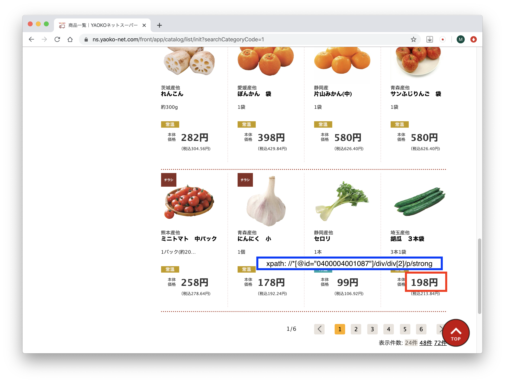
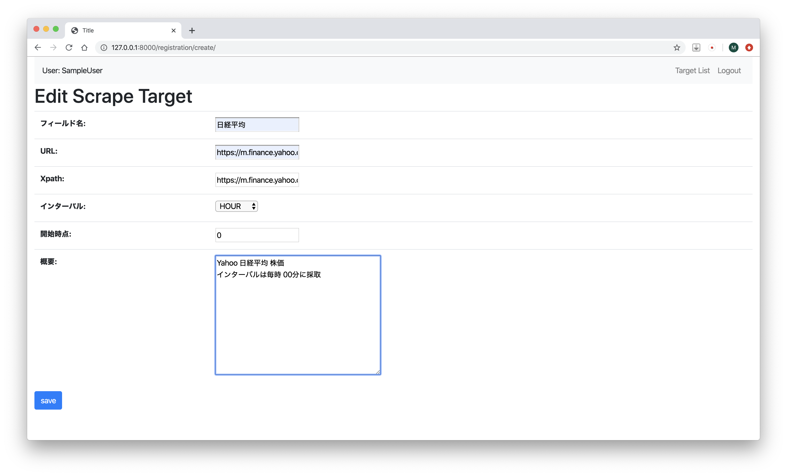
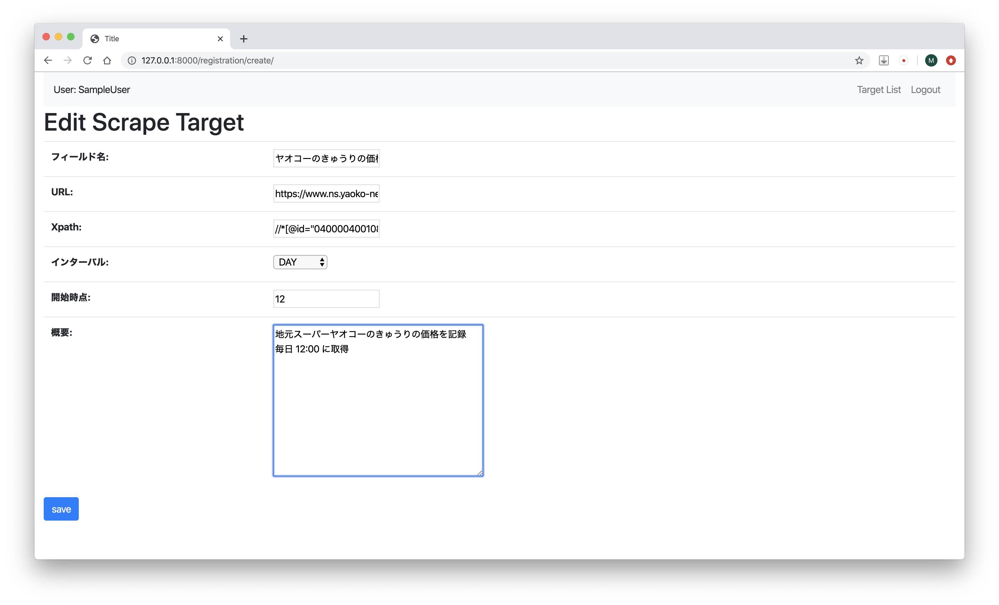
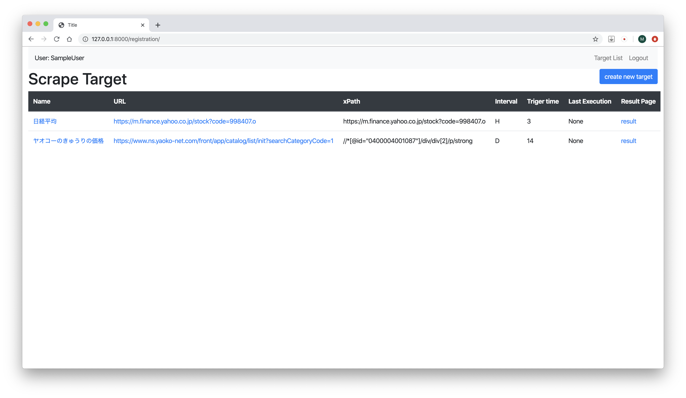
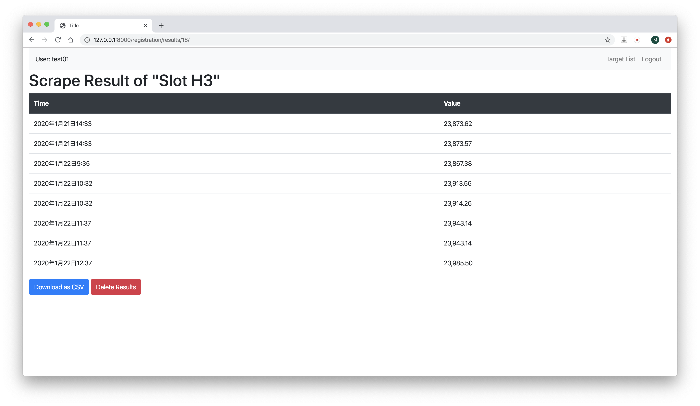
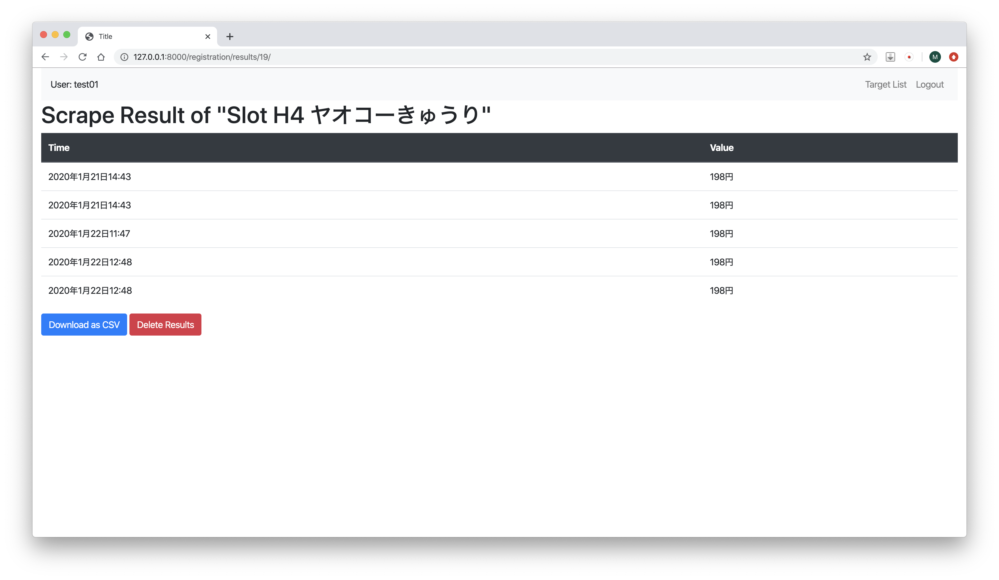

# scrape_service

## これは何？

[monkeypython-japan](https://monkeypython-japan.github.io/) のスキル展示を目的とした POC レベルの Django プロジェクトです。

ユーザが指定した URL と Xpath、インターバルに従い、Web ページのスクレイピングを行い、その結果をデータベースに保存します。
スクレイピングのインターバルは、毎週、毎日あるいは毎時の指定が出来ます。保存された結果は一覧ページで確認でき、CSV 形式のファイルとしてダウンロードが可能です。

## みていただきたい事

Django のプロジェクトとして実装を行っています。
“registration” app は Web インターフェースを使ってユーザのログイン、スクレイピングの指示内容の入力と変更、データベースへの更新を行います。
“scraper” app は定期的にデータベースからスクレイピングの仕様を取り出し、スクレイピングを実行して結果をデータベースに書き込みます。

このサービスは多数のユーザの登録内容を効率的に処理できるよう、スケーラビリティの実現にを主眼において開発を行っています。
scraper app では、スクレイピング実行の前に、タスクの統合を行い、複数のユーザが同一ページを指定している場合でも、一回のページアクセスで複数のユーザのスクレイピングを実行するようにしています。また、Web ページのアクセスは時間がかかるため、ページアクセスからスクレイピングの実行を複数のスレッドで並列化しています。このことにより多くのユーザのスクレイピングタスクを効率的に処理できます。

## アプリケーション概要

### registration

このサービスのユーザーインターフェースとデータベース管理を担当するアプリケーションです。ユーザ登録と認証、スクレイピングの仕様のメンテナンスから結果のダウンロードが主な機能です。Django の MVC (MVT) モデルに忠実な実装を行っています。

### scraper

Scraping を実際に実行するアプリケーションで、ユーザとのインタラクションは行いません。タイマーで定期的に実行され、データベースからそのインターバルで実行すべきスクレイピングの仕様を取り出し、スクレイピング処理を行い、結果を各ユーザのデータベースに格納します。スクレイピングの実行前に、タスクの統合を行い、ユーザ間で指定が重複する場合でも、一つのページに一度だけのアクセスで処理するようにタスクをスケジュールします。ページごとにまとまられたタスクは Thead Pool を使用して並列化して実行します。タスクの統合には独自に実装した、多分木データ構造を使用しています。また、HTMLパーサには、負荷が少ない xlml.html を使用しています。

### accounts

このサービスのユーザ管理を行います。ログインページからのログイン、新規ユーザ登録、そしてログアウトを行う機能を提供します。

### download

Scrape した結果を、ローカルの CSV ファイルにダウンロードするためのアプリケーションです。

## Container

このプロジェクトでは静的なコンテンツは殆ど含まれていないため、uWSGI を Web Server として使っています。

## ToDo

* Container での実行をサポートする。 (作業中)

* ~~Bug fix~~  (随時修正)

* ~~見栄えの改善~~

* ~~CSV ダウンロード (現在作業中)~~
  * ~~結果ページに、ダウンロードリンクを設置する。~~

* ~~指定されたインターバルでの実行~~
  * ~~現在のインターバルスロットに該当するタスクだけ取り出して実行するようにする。~~

* ~~ログインページ~~
  * ~~登録済みユーザの認証ページをの制作。新規ユーザ登録のリンクもここに設置。~~
* ~~ユーザ登録~~
  * ~~新規ユーザの登録ページの制作。~~

## 開発環境
* Python  3.8.0
* django 3.0
* Bootstrap 4
* PyCharm 2019.3.1 (CE)
* Docker Desktop for Mac 2.0.1.5

## スクリーンショット
### スクレイプのターゲットの準備
準備として対象となるページの URL とページ内要素の xpath を確認しておきます。

* 例1  Yahoo Finance の日経平均

* 例2 オンランスーパーのきゅうりの値段

### ターゲットの登録
ターゲットとしてURL と Xpath を登録します。
スクレイプを実行するインターバルを、毎週、毎日、毎時から任意の時間を設定できます。
サービス内部では 10分ごとにタスクの実行を行ってます。

* 日経平均  ( 取得のインターバルは 毎時 00分に設定 )

* オンラインスーパーのきゅうりの値段 ( インターバルは毎日12時に設定 )

### スクレイプターゲット一覧
右端の result のリンクから結果一覧のページに移動できます。

### スクレイプ結果の表示
ターゲット一覧から結果のページを表示します。この結果は、CSV ファイルとしてダウンロード可能。
(このスクリーンショットは上記の例示とは異なるターゲットのテスト画面です。参考としてご覧ください。)

* 日経平均のスクレイプ結果一覧    

* きゅうりの値段のスクレイプ結果一覧
